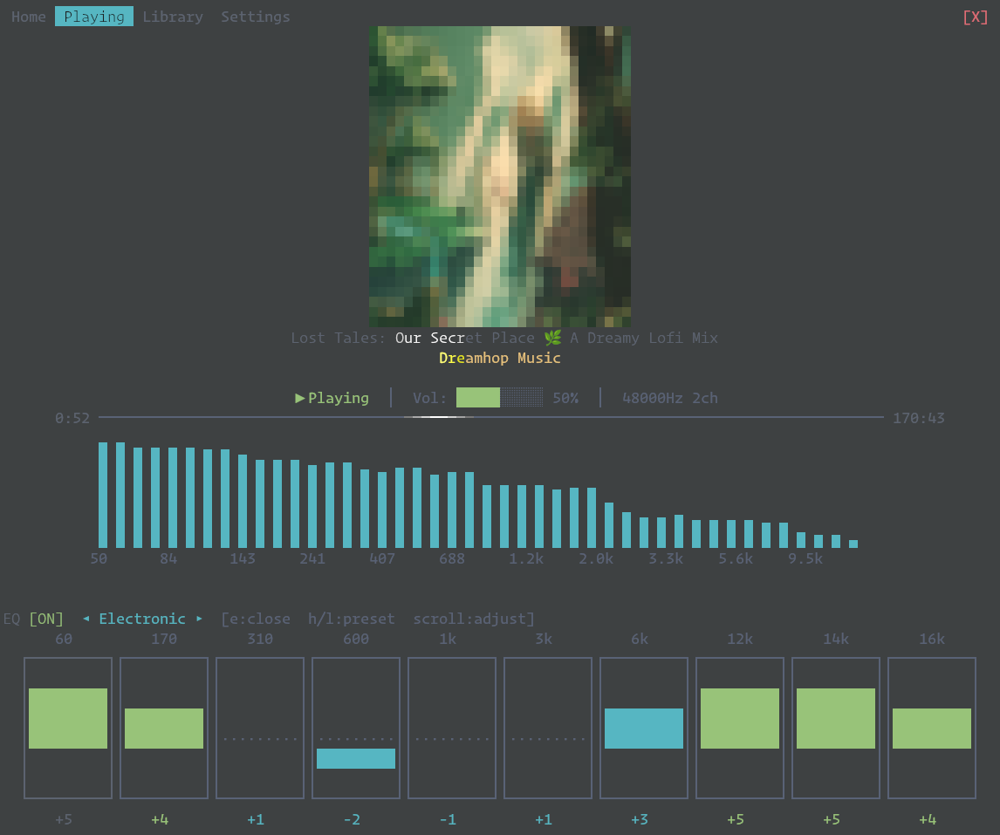
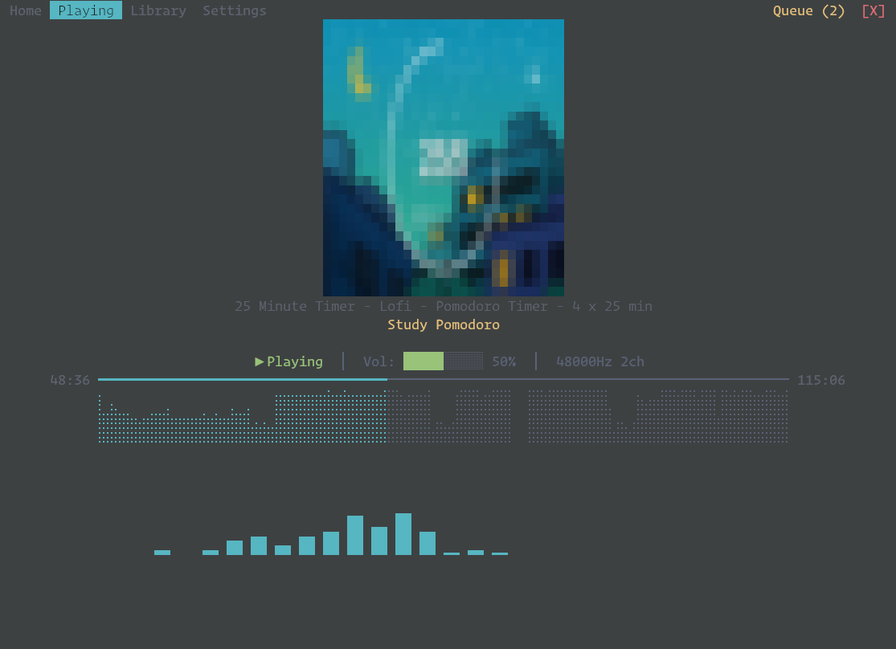
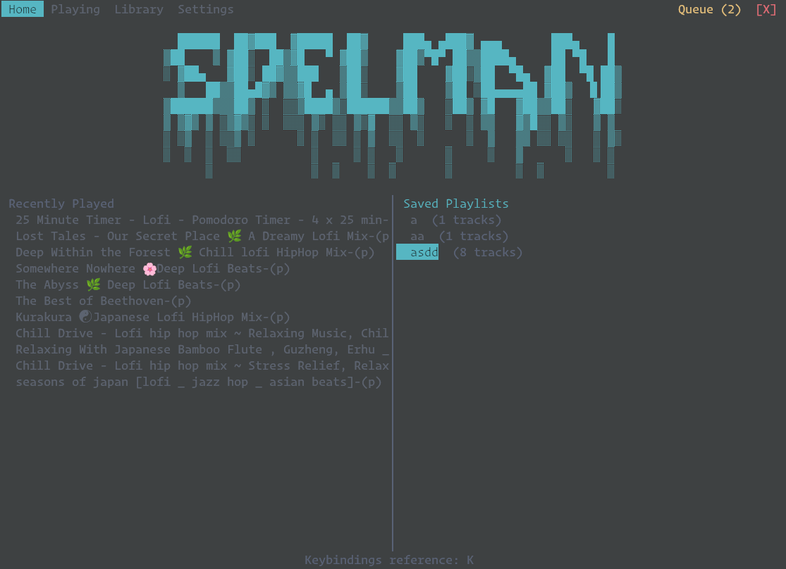

# Spelman
## [Swedish] The one who plays.

A modern, feature-rich terminal music player built in Rust.







## Features

- **Audio playback** — MP3, FLAC, OGG, Opus, WAV, AAC via Symphonia (pure Rust)
- **Gapless playback** — seamless album transitions with ReplayGain normalization
- **Low-latency audio** — cpal output with lock-free ring buffer, no allocations in the audio callback
- **Visualizers** — real-time FFT spectrum, Chroma GPU effects, waveform overview
- **Album art** — Kitty/iTerm2 image protocol with ASCII art fallback
- **10-band graphic EQ** — real-time biquad filters with presets
- **Metadata display** — title, artist, album via lofty
- **TUI** — ratatui-based interface with tabs, seek bar, volume, level meter
- **Pomodoro timer** — built-in pomodoro overlay
- **Lyrics** — fetch and display lyrics for the current track

## Building

```sh
cargo build --release
```

Requires ALSA development libraries on Linux:
```sh
# Fedora
sudo dnf install alsa-lib-devel

# Ubuntu/Debian
sudo apt install libasound2-dev
```

## Architecture

```
┌─────────────────┐   crossbeam channels   ┌──────────────────┐
│   Main Thread    │◄──────────────────────►│  Audio Thread     │
│  (ratatui loop)  │   AudioCommand/Event   │  (cpal callback)  │
└────────┬─────────┘                        └──────────────────┘
         │                                          ▲
         │                                    Ring Buffer
         │                                          │
         │                                  ┌──────────────────┐
         │                                  │  Decode Thread    │
         │                                  │  (symphonia +DSP) │
         │                                  └──────────────────┘
         │
         ▼
┌──────────────────┐
│  Library Thread   │
│  (scan + index)   │
└──────────────────┘
```

- **Main thread**: ratatui event loop, input handling, UI rendering (~60fps)
- **Audio engine thread**: Symphonia decoding → ReplayGain → EQ → ring buffer, sends position/level/spectrum events via crossbeam
- **cpal callback**: reads from lock-free ring buffer (real-time safe), volume ramp, spectrum tap

## Roadmap

See [ROADMAP.md](ROADMAP.md) for where we're headed.

## Credits

Inspired by [kew](https://github.com/ravachol/kew) by ravachol. Spelman is a ground-up Rust rewrite, not a fork.

## License

GPL-3.0
